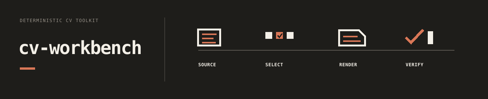

# 

[](https://github.com/e-south/cv-workbench/actions/workflows/ci.yml?query=branch%3Amain)

A deterministic CV/resume workbench. This repository is the public engine;
private CV content lives in a separate Source of Truth (SoT) directory outside
git.

Use [docs/readme.md](docs/readme.md) as the canonical docs router. The root
README is intentionally a light front door; `docs/readme.md` carries the fuller
workflow map, contracts, and maintainer routes.

## Documentation

- [docs/readme.md](docs/readme.md): central docs router and usage-flow index
- [docs/howto/quickstart.md](docs/howto/quickstart.md): first successful local build
- [docs/reference/context-contract.md](docs/reference/context-contract.md): automation/bootstrap contract
- [docs/reference/preview-contract.md](docs/reference/preview-contract.md): local build and preview contract
- [docs/reference/project-contract.md](docs/reference/project-contract.md): project guide, reviewpack, import, and guarded patching
- [docs/reference/verify-contract.md](docs/reference/verify-contract.md): repo-local verification harness
- [docs/reference/site-contract.md](docs/reference/site-contract.md): public artifact and site ownership boundary
- [docs/howto/publish-site.md](docs/howto/publish-site.md): faithful authored-DOCX publication flow
- [docs/reference/documentation-contract.md](docs/reference/documentation-contract.md): agent-facing frontmatter and progressive disclosure
- [docs/concepts/architecture.md](docs/concepts/architecture.md): boundaries and design constraints

## Start Here

Requirements:
- Python 3.12
- uv
- Pandoc
- LaTeX engine (`xelatex`) for PDF output

```bash
uv sync --locked
uv run cvw init --sample-default
uv run cvw doctor
uv run cvw quickstart
```

## Deterministic Entry Points

```bash
uv run cvw context --json --compact
uv run cvw workflow --id automation.verify
uv run cvw workflow --id automation.verify --json --compact
uv run python scripts/verify_repo.py
```

## Usage Lanes

- Build and preview: start with [docs/howto/quickstart.md](docs/howto/quickstart.md), then use [docs/reference/preview-contract.md](docs/reference/preview-contract.md) for explicit render and preview behavior.
- Job tailoring and proposal review: start with [docs/howto/ingestion.md](docs/howto/ingestion.md), then use [docs/reference/project-contract.md](docs/reference/project-contract.md).
- Automation and agent bootstrap: start with [docs/reference/context-contract.md](docs/reference/context-contract.md), then narrow to [docs/reference/verify-contract.md](docs/reference/verify-contract.md).
- Styling and versioned SoT: use [docs/howto/styling.md](docs/howto/styling.md) and [docs/howto/sot-versions.md](docs/howto/sot-versions.md).
- Authored CV publication and site sync: use [docs/howto/publish-site.md](docs/howto/publish-site.md), then [docs/reference/site-contract.md](docs/reference/site-contract.md).

## Scope Boundary

cv-workbench is strong on deterministic generation, local preview, project-local
proposal patching, review packaging, and export. Guided tailoring and review
import can generate guarded patch ops, but free-form NL rewriting and GUI SoT editing
are intentionally out of scope.

## License

MIT
